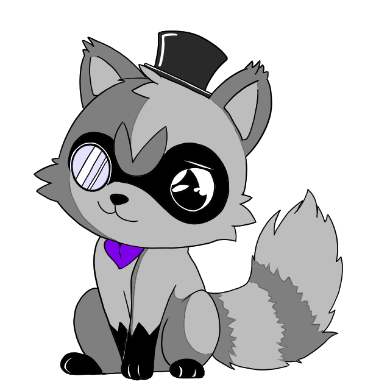

<!-- PROJECT LOGO -->
 

  

  <h3 align="center">Gabbracoon</h3>
  
  

    Secure Modular API
     
     
    <a href="https://rhubarbvr.net/">Web Site</a>
    ·
    <a href="https://discord.com/invite/GTQhxeq/">Discord</a>
  

## About The Project

This is the modular scalable API that is used by [RhubarbVR](https://github.com/RhubarbVR/RhubarbVR)

## The Character Gabbracoon

Gabbracoon is a unique and mysterious creature that has become the driving force behind the social communications and security of the RhubarbVR platform. Donning a sophisticated top hat and monocle, Gabbracoon exudes charm, wisdom, and wit.
